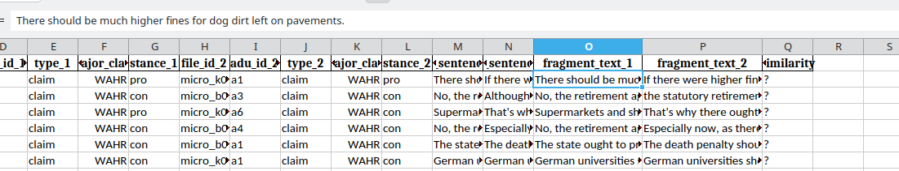

# Annotation

## Scheme

For annotation we closely follow the method of Misra et al. [^1]

Underlying is the idea of a facet which they define as:
> Facet: A facet is a low level issue that often reoccurs in many arguments in support of the author’s stance or in attacking the other author’s position. There are many ways to argue for your stance on a topic. For example, in a discussion about the death penalty you may argue in favor of it by claiming that it deters crime. Alternatively, you may argue in favor of the death penalty because it gives victims of the crimes closure. On the other hand you may argue against the death penalty because some innocent people will be wrongfully executed or because it is a cruel and unusual punishment. Each of these specific points is a facet. For two utterances to be about the same facet, it is not necessary that the authors have the same belief toward the facet. For example, one author may believe that the death penalty is a cruel and unusual punishment while the other one attacks that position. However, in order to attack that position they must be discussing the same facet."

Two arguments of the same topic are to be assigned a value from 1 to 5 depending on their similarity. 0 is reserved for the case when they come from different topics. This should not happen in our case as we only compare topics within one topic.

Misra et al. [^1] specify when to apply each like this:

> (5) Completely equivalent, mean pretty much exactly the same thing, using different words.
>
> (4) Mostly equivalent, but some unimportant details differ. One argument may be more specific than another or include a relatively unimportant extra fact.
>
> (3) Roughly equivalent, but some important information differs or is missing. This includes cases where the argument is about the same FACET but the authors have different stances on that facet.
>
> (2) Not equivalent, but share some details. For example, talking about the same entities but making different arguments (different facets)
>
> (1) Not equivalent, but are on same topic
>
> (0) On a different topic"

[^1]: https://aclanthology.org/W16-3636/ but originally introduced in https://aclanthology.org/N15-1046/

## Practical notes

Made using the script `make_annotation_pairs.py` there are chunks of 200 random pairs.

The three most important two columns are the most important. Typically one would read both segment texts using the top bar and then make a judgement which is to be entered in the similarity column instead of the `?`. If necessary the full sentence can be read in the two columns before it.

